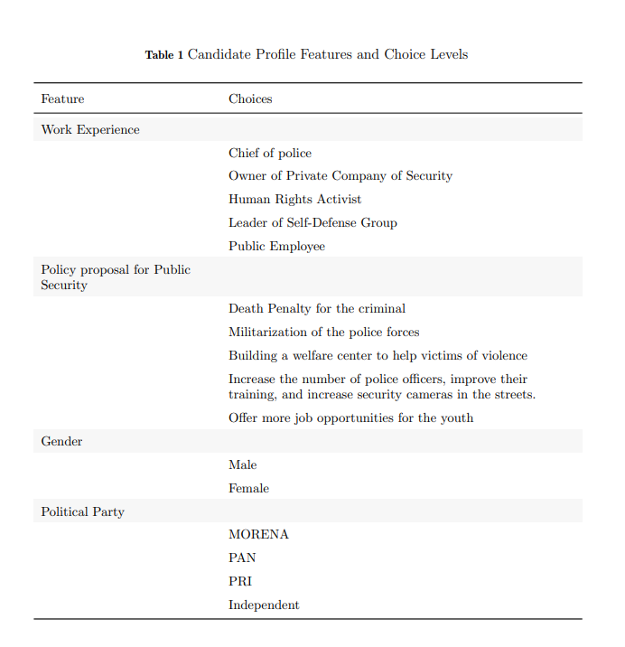
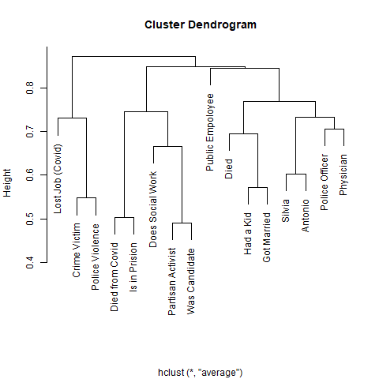
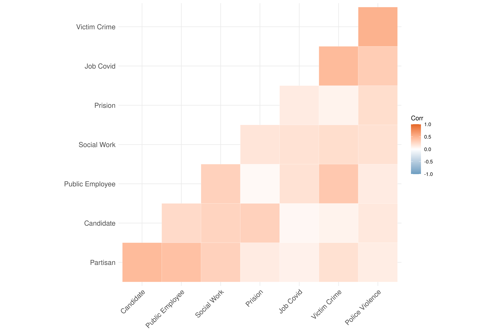
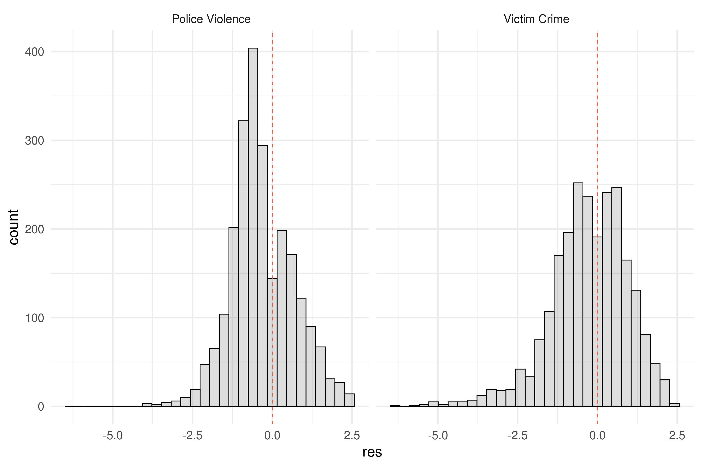
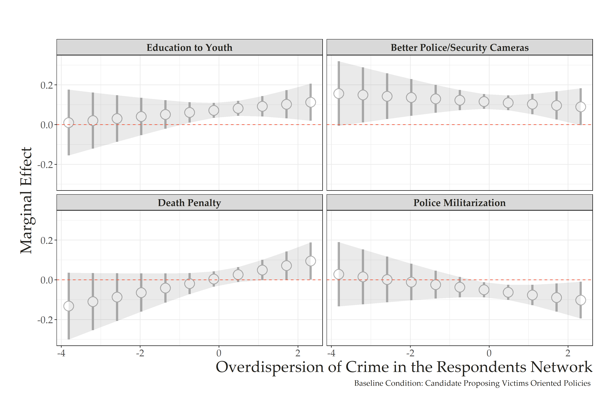
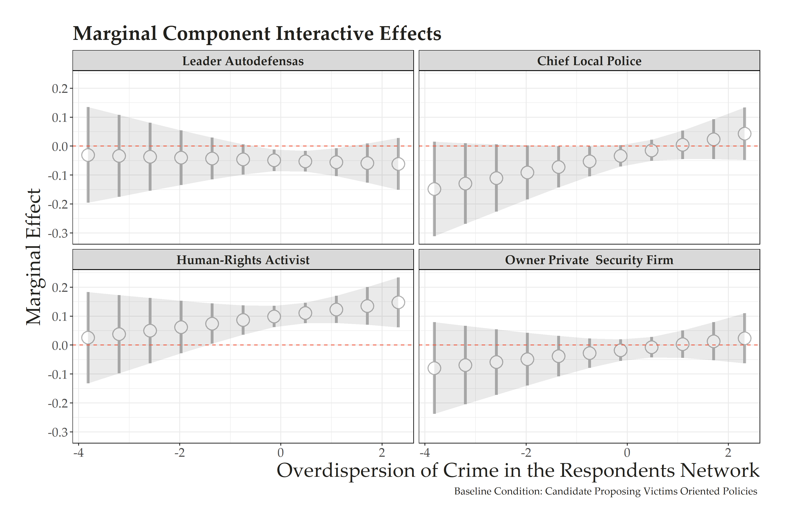

```{r setup, include=FALSE}
options(htmltools.dir.version = FALSE)
knitr::opts_chunk$set(messagwese=FALSE, warning = FALSE)
xaringanthemer::style_mono_accent(base_color ="#23395b", 
                                  title_slide_text_color="#23395b", 
                                  title_slide_background_color = "#fff", 
                                  background_color = "#fff", 
                                  link_color =  "#C93312")

options(htmltools.dir.version = FALSE)
knitr::opts_chunk$set(message=FALSE, warning = FALSE, error=TRUE, echo=FALSE, cache=TRUE)
```

```{r style-share-again, echo=FALSE}
xaringanExtra::use_tile_view()
xaringanExtra::use_panelset()

#xaringanExtra::style_share_again(
#  share_buttons = c("twitter", "linkedin", "pocket")
#)
```

name: about-me
layout: false
class: about-me-slide, inverse, middle, center
## .red[About me!]


### Tiago Ventura (He/Him)

#### Postdoc at the Center for Social Media and Politics, NYU.

.fade[PhD Government and Politics, University of Maryland, College Park]

[`r icons::simple_icons("twitter")` @TiagoVentura_](https://twitter.com/_Tiagoventura)
[`r icons::simple_icons("github")` TiagoVentura](https://github.com/TiagoVentura)
[`r icons::ionicons("mail")` venturat@umd.edu](venturat@umd.edu)
[`r icons::ionicons("link-outline")`https://tiagoventura.rbind.io/](https://tiagoventura.rbind.io/)


---
class: middle

## Motivation

--
**Crime and violence have spiked in Latin America's democracies, not only in urban centers but all over the continent.**

-  On average, 20 percent of the population in every Latin American country has been a victim of crime during the past 12 months. 

- Personal security has peaked among citizens' concerns.

--

---
class:middle 

## Motivation

**As violence and insecurity expand, citizens have demanded new and effective approaches to control crime**

- About eight out of ten Latin Americans support harsher punishment of criminals to reduce crime

- Approval rates for the intervention of the armed forces to combat crime sit above 60% for all countries in the region


---
class:middle 

### How does exposure to violence affect supply and demand of more punitive security policies in democracies afflicted by crime? 


---
class:middle

## .center[.red[Survey data in Mexico]]

### .center[`r icons::fontawesome("plus")`]

## .center[.red[Candidate choice conjoint design]]

### .center[`r icons::fontawesome("plus")`]

## .center[.red["How many people you know?"]]

#### .center[.fade[Friendship network modeling]]

---
### Conjoint Design
.center[
```{r out.width="70%"}

```
]
---
class: middle

## Challenges on measuring victimization

Most of the literature in political science focusing on behavioral effects of victimization uses .red[survey measures of individual victimization] or .red[fear of crime]

--

**`r icons::fontawesome("arrow-alt-circle-right")` Even in violent democracies, victimization is a rare event.**


--

**`r icons::fontawesome("arrow-alt-circle-right")` Victimization is a repeated process (Moncada, 2020)**

--

**`r icons::fontawesome("arrow-alt-circle-right")` Victimization is subject to social desirability bias.**

--


---
## A Network Approach to Crime Victimization

Given the methodological challenges in the measurement of crime victimization, we develop a novel measure by using respondents’ information from their friendship network .red[(Zheng et al., 2006; McCormick et al., 2010; McCormick and Zheng, 2013; Calvo and Murillo, 2013)].

--
- Build respondents friendship network using: "How many X's do you know, who also know you and whom you have interacted with in person, by phone, or through some other media in the last year?" 

--

- The X's represent a vector of eighteen indirect items (called Silvia, work as physicians, or work as teachers). 

--

- Within this battery of questions: victims of crime in the last year.

--
---
class: inverse, middle, center

### With this data we measure .red[size], .red[group prevalence] and .red[overdispersion] of our groups in our respondents' friendship network. 

---
class: middle

## Model

--
$$
\begin{equation}
y_{ik} \sim \text{Negative-Binomial}(e^{\alpha_i + \beta_k +\epsilon_{ik}}, \omega_k)
\end{equation}
$$

--

<br><br>

- $\alpha_i$: size of the respondent $i$'s network.

- $\beta_k$: relative prevalence of each group $k$ in the population

- $\omega_k$ controls the overdispersion of the groups $k$. 

--

---
class: middle

### Measuring overdisperson

--

$$
\begin{equation}
r_{ik} = \sqrt{y_{ik}} - \sqrt{e^{\alpha_i + \beta_k}}
\end{equation}
$$
<br><br>

The $r_{ik}$ a higher(lower) residual value indicates that the  respondent is more(less) exposed to criminal violence in their network of friends that expected by our modelling strategy

--


---
class: inverse, middle, center

## Results
---
### Dendogram
.center[
```{r out.width="70%"}

```
]

---
### Correlation Matrix
.center[
```{r out.width="100%"}

```
]

---
### Densities
.center[
```{r out.width="100%"}

```
]

---
### Conjoint Results I

.center[
```{r out.width="100%"}

```
]

---
### Conjoint Results II
.center[
```{r out.width="100%"}

```
]

---
class:middle
### Next Steps

- Add more robustness checks for the measure. 

- Gather data from Argentina, Brazil and Uruguay (Maybe work on a more methodological piece).

- Expand on differences between crime and police victimization

---
class: inverse, middle, center

## Thank you!